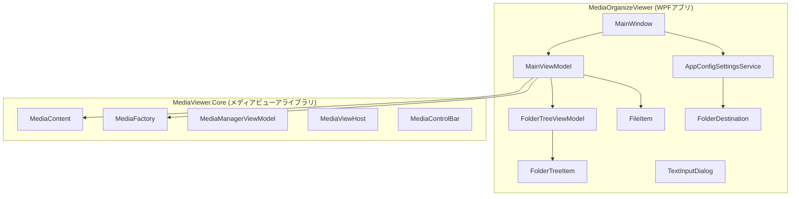
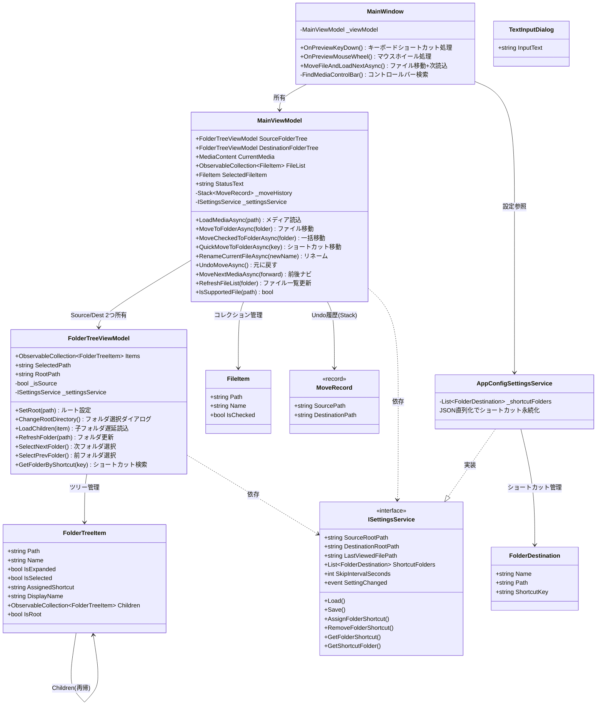
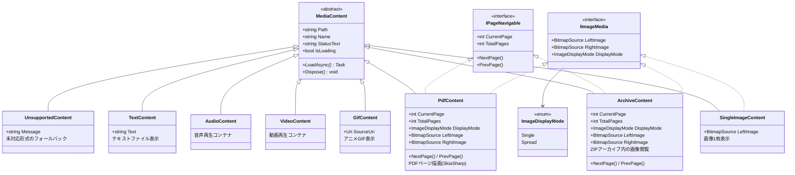
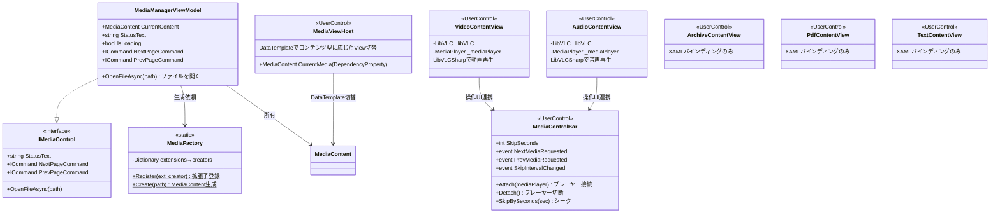
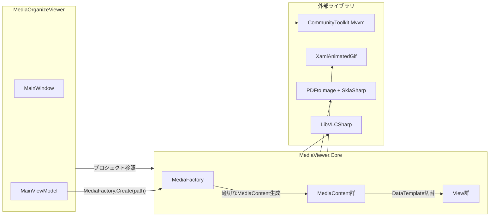
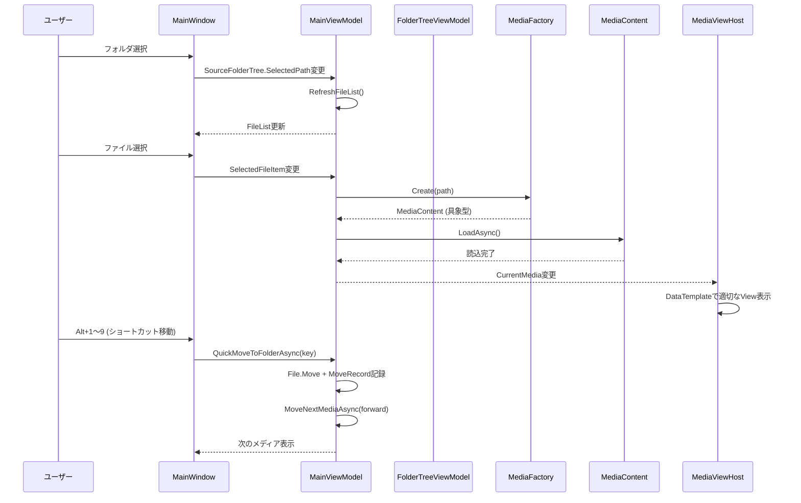

# MediaOrganizeViewer クラス構成図

## 全体アーキテクチャ

## MediaOrganizeViewer — クラス図

## MediaViewer.Core — クラス図

### コンテンツ型の継承階層

### ファクトリ・ViewModel・View

## プロジェクト間の依存関係とデータフロー

## 主要データフロー

## デザインパターン一覧

| パターン | 適用箇所 | 説明 |
|---------|---------|------|
| **Factory** | `MediaFactory` | ファイル拡張子→適切なMediaContentサブクラス生成 |
| **Template Method** | `MediaContent.LoadAsync()` | 基底クラスで共通フロー、サブクラスで具体的読込 |
| **Strategy** | `IPageNavigable` | ZIP/PDFで共通のページ送りインターフェース |
| **Observer** | `INotifyPropertyChanged` | 全ViewModel・Modelでデータバインディング |
| **MVVM** | 全体 | View↔ViewModel↔Modelの責務分離 |
| **Lazy Loading** | `FolderTreeViewModel` | フォルダ展開時に子要素を読込 |
| **Undo (Memento的)** | `Stack<MoveRecord>` | ファイル移動の取消し履歴 |
